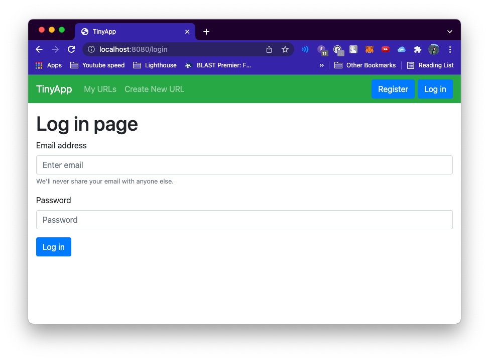
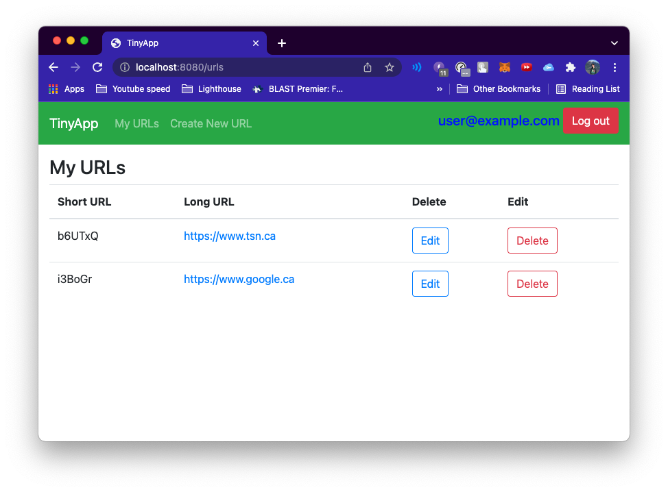
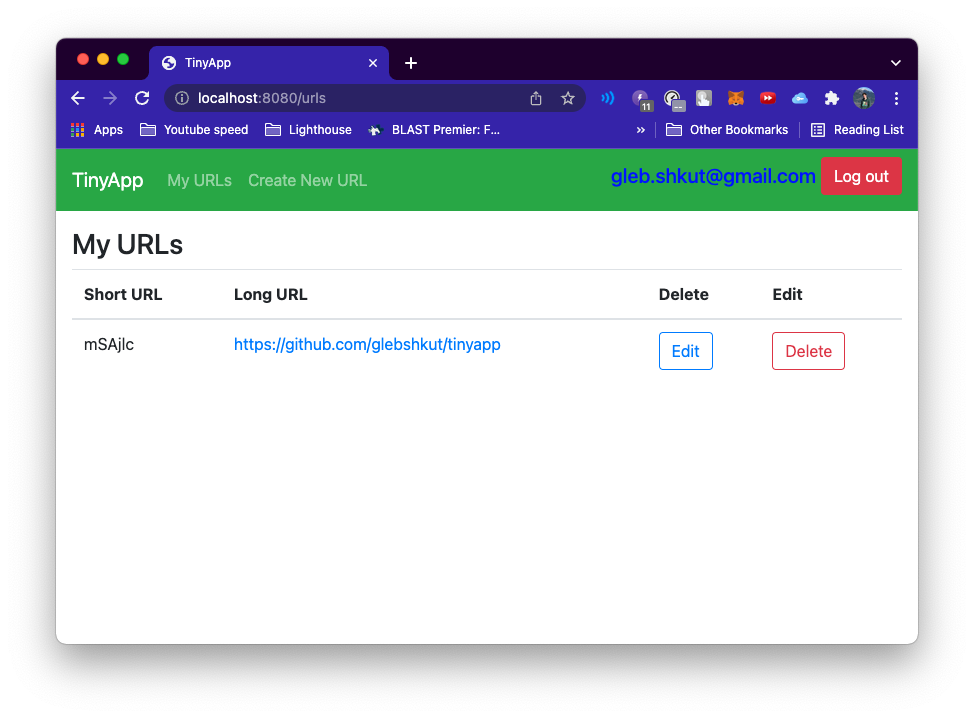
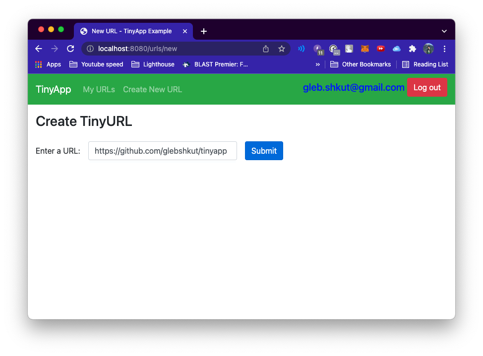
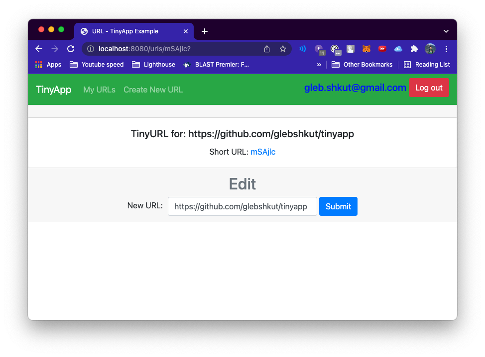
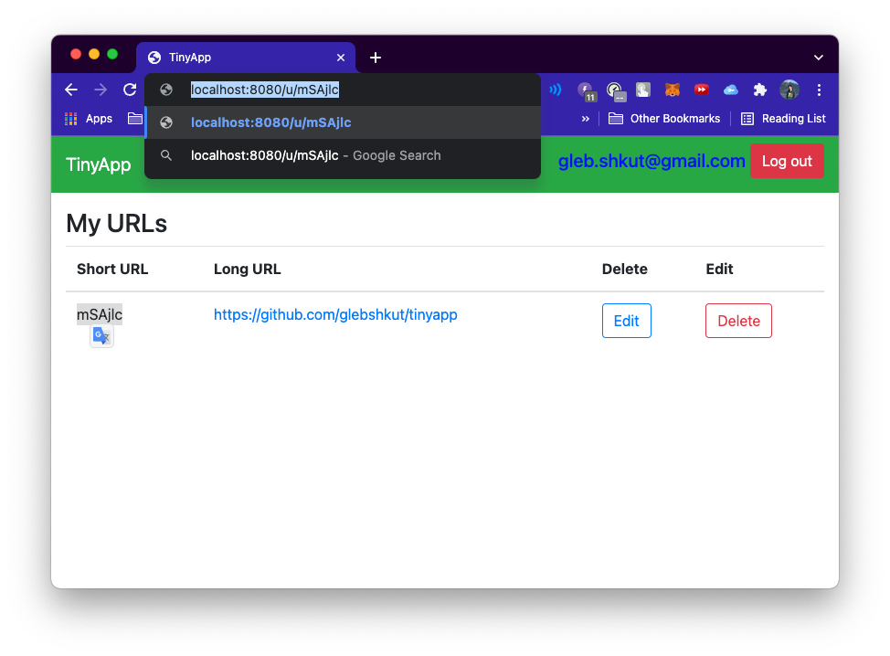

# TinyApp Project

TinyApp is a full stack web application built with Node and Express that allows users to shorten long URLs (à la [bit.ly](https://bitly.com/)).

## Final Product
***Login page***

***My URLs page***

## Dependencies

- Node.js
- Express
- EJS
- bcrypt
- body-parser
- cookie-session
- cookie-parser

## Getting Started

- Install all dependencies (using the `npm install` command).
- Run the development web server using the `node express_server.js` command.

## Features:
- Page of URLs, available for a particular user

- Creating a new tinyURL

- Editing tinyURLs

- Accessing longURL via tinyURL

To access your URL type in `http://localhost:8080/u/`:shortURL